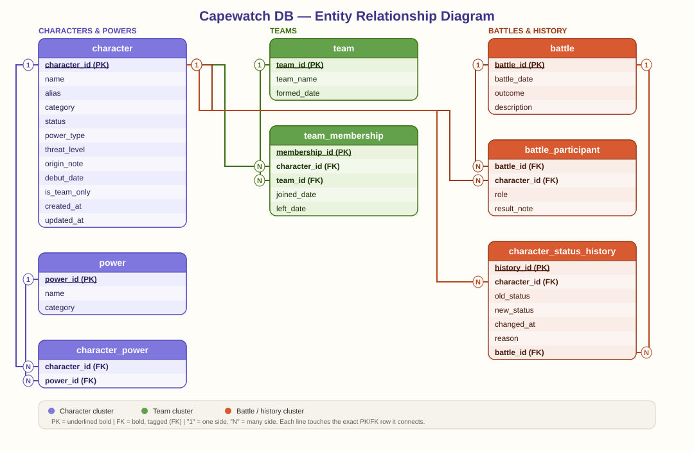

# Capewatch DB

A PostgreSQL database project modeling a superhero universe - characters, teams, and battle history - built to showcase schema design, recursive queries, window functions, triggers, and automated status tracking.

All characters, teams, and events are original creations, built specifically to avoid any trademark/copyright overlap with existing comic universes.

## Entity Relationship Diagram



*PK = underlined bold · FK = bold, tagged (FK) · "1"/"N" mark each relationship's cardinality. Each connector attaches directly to the row it represents.*

## Schema overview

| Table | Purpose |
|---|---|
| `character` | Core roster — heroes, anti-heroes, villains, with status, threat level, and origin story |
| `power` | Distinct powers/abilities in the universe |
| `character_power` | Many-to-many link between characters and their powers |
| `team` | Hero/villain teams and organizations |
| `team_membership` | Who belongs to which team, with join/leave dates |
| `battle` | Recorded battles/encounters |
| `battle_participant` | Who fought in each battle, on which side, and the outcome for them |
| `character_status_history` | Audit trail of status changes (e.g. villain → reformed hero), auto-logged by trigger |

## What this project demonstrates

- **Schema design** - 8 normalized tables, one-to-many and many-to-many relationships, nullable fields used deliberately (e.g. `left_date`, `alias`)
- **Recursive CTE** - traces a character's teammate network outward through shared team membership (see `07_showcase_queries.sql`)
- **Window functions** - threat-level ranking within category, and running win-count per hero over time
- **Triggers** — `updated_at` auto-maintained on every update; battle outcomes with a status-relevant `result_note` automatically log to `character_status_history`
- **Views** - `active_team_roster`, a live view of each team's current active members
- **Scheduled job (function)** - `decay_inactive_villain_threat()`, a callable function meant to run nightly via `pg_cron` or an external scheduler in a deployed environment. Not wired to a live scheduler in this local/demo setup - run it manually with `SELECT decay_inactive_villain_threat();` to see it work
- **Indexing** - an index added on `character.threat_level` with `EXPLAIN ANALYZE` before/after (see notes in `07_showcase_queries.sql` - on a dataset this small, Postgres may reasonably still choose a sequential scan; the file explains why)

## Setup

1. Create a database (e.g. `capewatch`) in PostgreSQL.
2. Run the SQL files **in order**:

```
00_schema.sql                     -- table definitions
01_seed_characters.sql            -- 72 original characters, with origin stories
02_seed_character_aliases.sql     -- civilian/real names
03_seed_powers.sql                -- powers + character-power links
04_seed_teams.sql                 -- teams + membership
05_seed_battles.sql               -- battles + participants
06_triggers_and_views.sql         -- triggers, view, scheduled-job function
08_backfill_status_history.sql    -- one-time backfill (see note below)
07_showcase_queries.sql           -- run these to explore the data
```

> **Note on file order:** `08_backfill_status_history.sql` runs after `06` but before `07` — the status-history trigger only applies to rows inserted *after* it's created, so this backfill catches up the battle data that was seeded earlier in the same setup, before the trigger existed. Any new battle data inserted after `06` runs will populate history automatically, without needing a backfill.

## License

MIT — see `LICENSE`.
